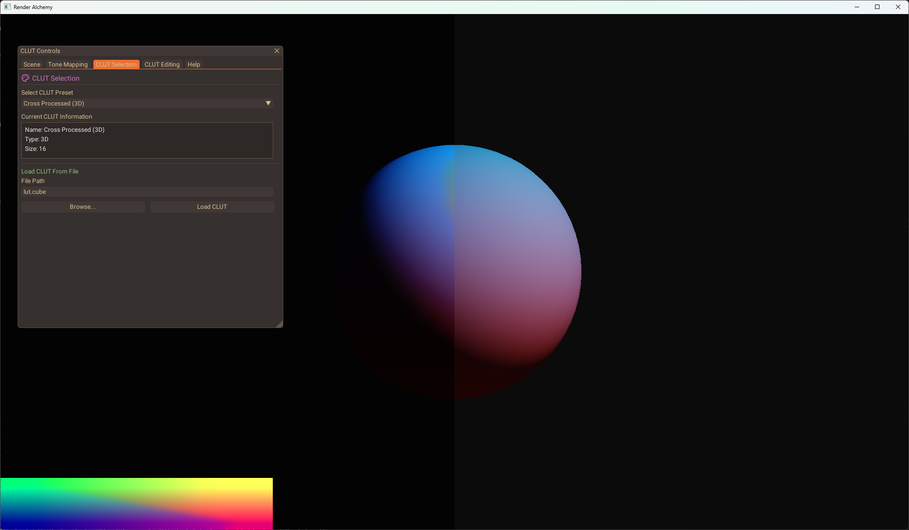

# RenderAlchemy


A modern OpenGL-based renderer for experimenting with post-processing effects and color grading techniques.



## Overview

RenderAlchemy serves as a testbed for me to experiment with various rendering techniques and effects. The application is built using modern OpenGL and provides a real-time 3D rendering environment with advanced post-processing capabilities, well it will be in the future. :D

## Features

- **Real-time 3D rendering** with adjustable camera and scene objects
- **Advanced color grading** with both 1D and 3D CLUTs
- **HDR rendering** with multiple tone mapping operators
- **CLUT editor** for creating custom color grades
- **Split-screen comparison** for before/after visualization
- **Modern UI** built with Dear ImGui
- **CLUT import/export** supporting industry-standard formats **WIP**

## Getting Started

### Prerequisites

- Visual Studio 2019 or newer
- OpenGL 3.3+ compatible graphics card

### Building the Project

1. Clone the repository:
```
git clone https://github.com/yourusername/RenderAlchemy.git
```

2. Open the project in Visual Studio:
```
Open RenderAlchemy.sln
```

### Running the Application

Launch `RenderAlchemy.exe` from the build directory. The application will display a 3D scene with various controls for adjusting rendering parameters and post-processing effects.

## Controls

The application interface is organized into tabs for easy navigation:

- **Scene**: Configure the 3D scene, camera position, and lighting
- **Tone Mapping**: Adjust exposure and tone mapping settings
- **CLUT Selection**: Choose from preset CLUTs or load custom ones
- **CLUT Editing**: Create and modify color lookup tables
- **Help**: View usage instructions and information

